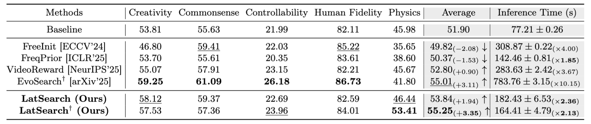

<div align="center">

# LatSearch: Latent Reward-Guided Search for Faster Inference-Time Scaling in Video Diffusion

**Zengqun Zhao · Ziquan Liu · Yu Cao· Shaogang Gong · Zhensong Zhang · Jifei Song · Jiankang Deng · Ioannis Patras**

Queen Mary University of London · Imperial College London

[](https://arxiv.org/abs/2603.14526)
[](https://zengqunzhao.github.io/LatSearch)

</div>

---

## 💡 TL;DR

**LatSearch** is an inference-time scaling method for video diffusion that uses a **latent reward model** to evaluate partially denoised latents during generation. By providing intermediate reward guidance along the denoising trajectory, LatSearch enables efficient reward-guided resampling and pruning, improving video quality while reducing runtime by up to **79%** compared to existing search-based approaches.

## 📖 Abstract

The recent success of inference-time scaling in large language models has inspired similar explorations in video diffusion. In particular, motivated by the existence of "golden noise" that enhances video quality, prior work has attempted to improve inference by optimising or searching for better initial noise. However, these approaches have notable limitations: they either rely on priors imposed at the beginning of noise sampling or on rewards evaluated only on the denoised and decoded videos. This leads to error accumulation, delayed and sparse reward signals, and prohibitive computational cost, which prevents the use of stronger search algorithms.

To fill in this gap, we enable efficient inference-time scaling for video diffusion through **latent reward guidance**, which provides intermediate, informative and efficient feedback along the denoising trajectory. We introduce a latent reward model that scores partially denoised latents at arbitrary timesteps with respect to visual quality, motion quality, and text alignment. Building on this model, we propose **LatSearch**, a novel inference-time search mechanism that performs **Reward-Guided Resampling and Pruning (RGRP)**:
- 🔵 **Resampling** — candidates are sampled according to reward-normalised probabilities to reduce over-reliance on the reward model
- ✂️ **Pruning** — applied at the final scheduled step, only the candidate with the highest cumulative reward is retained

We evaluate LatSearch on the VBench-2.0 benchmark and demonstrate that it consistently improves video generation across multiple evaluation dimensions compared to the baseline Wan2.1 model.

## 🔍 Method


**Figure 1.** An overview of a latent reward model (left) and the proposed latent reward-guided inference-time search method, LatSearch (right). On the left, input latent tokens are patchified, fused with timestep embeddings, and projected by a ViT encoder. Together with instruction tokens, text prompts, and special query tokens ([VQ], [MQ], [TA]), these form the input to a large language model. The model is trained using a combination of regression and preference losses. On the right, LatSearch maintains multiple candidate trajectories during a diffusion process. Candidates are periodically scored by the latent reward model, resampled with uniqueness to encourage diversity, and finally pruned based on cumulative rewards before decoding into the final video.

## 📈 Quantitative Results



**LatSearch achieves state-of-the-art performance on VBench-2.0**, consistently improving video generation across multiple evaluation dimensions compared to the baseline Wan2.1 model, while achieving comparable or better quality than existing methods with up to **79% reduction in runtime**.

## 🗓️ Release Progress

- [x] Paper
- [ ] Code
- [ ] Pre-trained models

*Code and pre-trained models will be released in 1-2 weeks.*

## 🔖 Citation

If you find this work useful for your research, please consider citing our paper and giving this repo a ⭐️.

```bibtex
@misc{zhao2026latsearch,
      title={LatSearch: Latent Reward-Guided Search for Faster Inference-Time Scaling in Video Diffusion}, 
      author={Zengqun Zhao and Ziquan Liu and Yu Cao and Shaogang Gong and Zhensong Zhang and Jifei Song and Jiankang Deng and Ioannis Patras},
      year={2026},
      eprint={2603.14526},
      archivePrefix={arXiv},
      primaryClass={cs.CV},
      url={https://arxiv.org/abs/2603.14526}, 
}
```

## 🙏 Acknowledgements

- [Wan2.1](https://github.com/Wan-Video/Wan2.1): the base video diffusion model we built upon. Thanks for their wonderful work.
