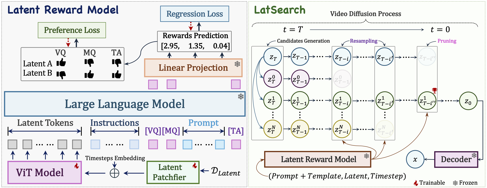

# LatSearch
## Latent Reward-Guided Search for Faster Inference-Time Scaling in Video Diffusion

**Authors:** Zengqun Zhao, Ziquan Liu, Yu Cao, Shaogang Gong, Zhensong Zhang, Jifei Song, Jiankang Deng, Ioannis Patras

## Method Summary

We introduce LatSearch, an inference-time scaling method for video diffusion that uses a latent reward model to evaluate partially denoised latents during generation. By providing intermediate reward guidance along the denoising trajectory, LatSearch enables efficient reward-guided resampling and pruning, improving video quality while reducing runtime by up to 79% compared to existing search-based approaches.
