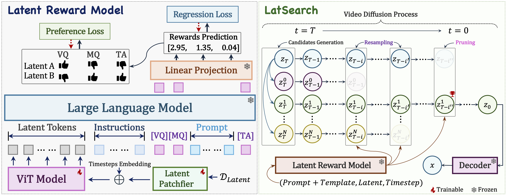
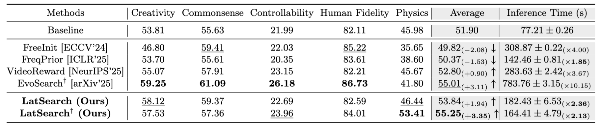
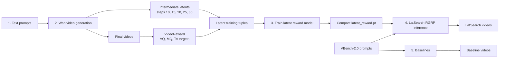

<div align="center">

# LatSearch

### Latent Reward-Guided Search for Faster Inference-Time Scaling in Video Diffusion

Zengqun Zhao · Ziquan Liu · Yu Cao · Shaogang Gong<br>
Zhensong Zhang · Jifei Song · Jiankang Deng · Ioannis Patras

Queen Mary University of London · Imperial College London

[](https://eccv.ecva.net/)
[](https://arxiv.org/abs/2603.14526)
[](https://zengqunzhao.github.io/LatSearch)
[](LICENSE)

**Accepted at ECCV 2026**

</div>

LatSearch is an inference-time scaling method for video diffusion. It evaluates
partially denoised latents during generation, then uses those intermediate
rewards to allocate computation to promising trajectories. Compared with
search methods that repeatedly decode full videos, LatSearch achieves comparable
or better generation quality while reducing runtime by up to **79%**.

This repository contains the LatSearch implementation, latent-reward training
code, VBench-2.0 prompts, and the FreeInit, FreqPrior, VideoReward, and EvoSearch
baselines used in our paper.

## Method



The latent reward model predicts three complementary scores from an intermediate
latent, its denoising timestep, and the text prompt:

- **Visual quality (VQ):** appearance, fidelity, and artifacts.
- **Motion quality (MQ):** temporal consistency and motion realism.
- **Text alignment (TA):** correspondence between the generated content and prompt.

Training targets are grounded by the cosine similarity between an intermediate
latent and the final clean latent. The reward model is optimized with regression
and pairwise preference losses.

During inference, **Reward-Guided Resampling and Pruning (RGRP)** maintains
multiple correlated trajectories. At scheduled denoising steps it:

1. scores every candidate in latent space;
2. samples candidates using reward-normalized probabilities;
3. removes duplicate trajectories to avoid redundant computation; and
4. retains the candidate with the highest cumulative reward at the final search step.

## Results



The principal Wan2.1-1.3B comparison from the paper is summarized below. Runtime
was measured on an NVIDIA A100 GPU. See the paper for per-dimension results,
additional backbones, longer videos, 720p generation, and ablations.

| Method | VBench-2.0 average | Runtime (s) |
| --- | ---: | ---: |
| Wan2.1 baseline | 51.90 | 77.21 |
| FreeInit | 49.82 | 308.87 |
| FreqPrior | 50.37 | 142.46 |
| VideoReward best-of-N | 52.80 | 283.63 |
| EvoSearch | 55.01 | 783.76 |
| **LatSearch (UniPC)** | **53.84** | **182.43** |
| **LatSearch (DPM-Solver++)** | **55.25** | **164.41** |

## Installation

### Requirements

- Linux, Python 3.10, and an NVIDIA GPU
- CUDA 12.4-compatible PyTorch 2.6
- Git LFS and `ffmpeg`

```bash
git clone https://github.com/zengqunzhao/LatSearch.git
cd LatSearch

conda create -n latsearch python=3.10 -y
conda activate latsearch
pip install -r requirements.txt
pip install flash-attn==2.7.4.post1 --no-build-isolation
```

`environment.yml` is also provided for Conda-based setup.

### Checkpoints

Download the public Wan2.1-1.3B and VideoReward checkpoints:

```bash
mkdir -p checkpoints

hf download Wan-AI/Wan2.1-T2V-1.3B \
  --local-dir checkpoints/Wan2.1-T2V-1.3B

hf download KwaiVGI/VideoReward \
  --local-dir checkpoints/VideoReward
```

> **LatSearch checkpoint:** The pretrained latent reward checkpoint is being
> prepared for public release. The download command will be added here when it
> is available. Until then, it can be reproduced using the training pipeline
> below.

After downloading or training it, place the LatSearch latent reward checkpoint
at `checkpoints/latent_reward.pt`. The expected layout is:

```text
checkpoints/
├── Wan2.1-T2V-1.3B/
├── VideoReward/
│   ├── model_config.json
│   └── checkpoint-*/
└── latent_reward.pt
```

The latent reward checkpoint is not the VideoReward checkpoint. VideoReward
provides the frozen multimodal backbone and reward head, while
`latent_reward.pt` stores only the trainable LatSearch visual encoder and
timestep embedding. Both are required for inference.

## Quick Start

Generate one 33-frame, 480p video with the paper's default search schedule:

```bash
python generate.py \
  --prompt "A red panda plays a tiny guitar beside a mountain stream." \
  --model-path checkpoints/Wan2.1-T2V-1.3B \
  --reward-backbone-path checkpoints/VideoReward \
  --latent-reward-checkpoint checkpoints/latent_reward.pt \
  --search-schedule 10 15 20 \
  --num-candidates 6 \
  --noise-perturbation 0.1 \
  --temperature 1.0 \
  --output-dir outputs/latsearch
```

The default solver is UniPC. Add `--solver dpm++` to run the DPM-Solver++
configuration. Use `python generate.py --help` for all generation and search
options.

### Prompt files

`generate.py` accepts either one `--prompt` or a JSON `--prompt-file`.
VBench-style records are supported directly:

```json
[
  {
    "prompt_en": "Garden, zoom in.",
    "dimension": ["Camera_Motion"]
  }
]
```

For example, generate the Camera Motion subset of VBench-2.0:

```bash
python generate.py \
  --prompt-file prompts/VBench2_full_info.json \
  --dimensions Camera_Motion \
  --model-path checkpoints/Wan2.1-T2V-1.3B \
  --reward-backbone-path checkpoints/VideoReward \
  --latent-reward-checkpoint checkpoints/latent_reward.pt \
  --samples-per-prompt 3
```

`scripts/run_latsearch.sh` and `scripts/run_vbench2.sh` provide complete shell
examples. Paths can be overridden with `MODEL_PATH`, `VIDEO_REWARD_PATH`, and
`LATENT_REWARD_PATH`.

## Included Baselines

The baseline integrations use the same Wan2.1 backbone and generation settings
for controlled comparison. They are provided for research reproducibility and
are not contributions of this work.

| CLI method | Reference | Paper configuration |
| --- | --- | --- |
| `wan` | [Wan2.1](https://github.com/Wan-Video/Wan2.1) | 50 steps, CFG 5.0 |
| `freeinit` | [FreeInit](https://github.com/TianxingWu/FreeInit) | Four extra iterations, Butterworth filter |
| `freqprior` | [FreqPrior](https://github.com/fudan-zvg/FreqPrior) | Two extra iterations, ratio 0.8 |
| `video-reward` | [VideoReward](https://github.com/KwaiVGI/VideoAlign) | Best-of-4 selection |
| `evosearch` | [EvoSearch](https://github.com/tinnerhrhe/EvoSearch-codes) | Population 6/3/3, schedule 5/20 |

Run any baseline through the shared interface:

```bash
python generate_baseline.py \
  --method freeinit \
  --prompt "A red panda plays a tiny guitar beside a mountain stream." \
  --model-path checkpoints/Wan2.1-T2V-1.3B
```

VideoReward and EvoSearch additionally require
`--video-reward-path checkpoints/VideoReward`. Run
`python generate_baseline.py --help` for method-specific controls.

## Training the Latent Reward Model

### End-to-end pipeline


```mermaid
flowchart LR
    A["1. Text prompts"] --> B["2. Wan video generation"]
    B --> C["Intermediate latents<br/>steps 10, 15, 20, 25, 30"]
    B --> D["Final videos"]
    D --> E["VideoReward<br/>VQ, MQ, TA targets"]
    C --> F["Latent training tuples"]
    E --> F
    F --> G["3. Train latent reward model"]
    G --> H["Compact latent_reward.pt"]
    H --> I["4. LatSearch RGRP inference"]
    V["VBench-2.0 prompts"] --> I
    I --> J["LatSearch videos"]
    V --> K["5. Baselines"]
    K --> L["Baseline videos"]
```

The LatSearch and baseline entry points use the same VBench-2.0 evaluation
prompts, Wan checkpoint, resolution, frame count, sampling steps, and guidance
scale. This keeps method comparisons controlled while LatSearch remains the
primary contribution of this repository.

### 1. Collect intermediate latents

`prepare_latent_data.py` generates videos, stores intermediate denoising states,
computes cosine similarity to the final latent, and obtains VQ/MQ/TA targets
from VideoReward. The released recipe uses the 945 prompt entries in
`prompts/LatSearch_train_prompts.json` for training-data generation. VBench-2.0 prompts
remain separate and are used for evaluation.

```bash
python prepare_latent_data.py \
  --prompt-file prompts/LatSearch_train_prompts.json \
  --model-path checkpoints/Wan2.1-T2V-1.3B \
  --video-reward-path checkpoints/VideoReward \
  --output-dir data \
  --seeds 200 300 400 500 600 \
  --selected-steps 10 15 20 25 30 \
  --num-frames 33
```

Collection is resumable. It writes tensors under `data/seed_*` and one metadata
file per seed under `data/metadata`.

### 2. Train

The paper uses an 80/20 **prompt-level** split, batch size 4, learning rate
`1e-4`, 15 epochs, and equal regression/preference loss weights. All samples
generated from the same prompt, across every random seed, are assigned to the
same split to prevent prompt leakage:

```bash
python -m tools.train_latent_reward \
  --job_id wan13b \
  --json_root_path data/metadata \
  --load_from_pretrained checkpoints/VideoReward \
  --output_dir checkpoints \
  --checkpoint_name latent_reward.pt \
  --split_seed 1203 \
  --batch_size 4 \
  --lr 1e-4 \
  --epochs 15 \
  --milestones 10
```

Training overwrites one rolling checkpoint after every epoch instead of storing
the full Qwen/VideoReward backbone repeatedly. The checkpoint contains only
trainable tensors and is approximately 1.25 GiB for the current architecture,
compared with approximately 4.7 GiB for the legacy full state dictionary. Add
`--report_to_wandb` to enable experiment tracking. See
`examples/latent_metadata.json` for the generated metadata schema.

Existing full checkpoints can be converted without retraining:

```bash
python -m tools.compact_latent_reward_checkpoint \
  checkpoints/legacy_latent_reward.pt \
  checkpoints/latent_reward.pt
```

## Repository Layout

```text
LatSearch/
├── generate.py                     # canonical LatSearch inference CLI
├── generate_baseline.py            # shared baseline inference CLI
├── prepare_latent_data.py          # latent-reward dataset construction
├── latsearch/
│   └── reward/                      # latent reward model and data pipeline
├── third_party/
│   ├── WanVideoModel/               # Wan2.1 and search implementations
│   └── VideoReward/                 # video-level reward integration
├── tools/                           # training, scoring, and analysis utilities
├── prompts/                         # VBench and VBench-2.0 benchmark prompts
├── scripts/                         # reproducible shell recipes
└── examples/                        # public metadata-format example
```

LatSearch-specific reward modeling code lives under `latsearch/reward/`. The
canonical generation class is `WanT2VWithLatSearch`, and its RGRP sampler is
implemented in
`third_party/WanVideoModel/wan/text2video.py::WanT2VWithLatSearch.generate_with_latsearch`.
The same Wan integration contains the comparison samplers exposed through
`generate_baseline.py`.

## Citation

```bibtex
@inproceedings{zhao2026latsearch,
  title   = {LatSearch: Latent Reward-Guided Search for Faster Inference-Time Scaling in Video Diffusion},
  author  = {Zhao, Zengqun and Liu, Ziquan and Cao, Yu and Gong, Shaogang and Zhang, Zhensong and Song, Jifei and Deng, Jiankang and Patras, Ioannis},
  booktitle = {European Conference on Computer Vision (ECCV)},
  year    = {2026}
}
```

## Acknowledgements

This work builds on [Wan2.1](https://github.com/Wan-Video/Wan2.1) and
[VideoReward](https://github.com/KwaiVGI/VideoAlign). We also thank the authors
of FreeInit, FreqPrior, and EvoSearch. See [THIRD_PARTY.md](THIRD_PARTY.md) for
component-level attribution and licensing notes.

## License

The original LatSearch code is released under the [MIT License](LICENSE).
Third-party components remain subject to their respective licenses.
